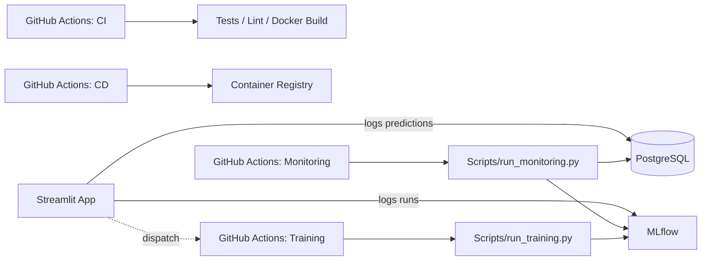

<div align="center">

# 📉 Churn Prediction MLOps App

**A production-style customer churn system — prediction, governance, monitoring, and automated retraining, end to end.**


</div>

---

## 🖼️ Preview

<p align="center">
  
</p>

---

## 📚 Table of Contents

- [What This Is](#-what-this-is)
- [Architecture](#-architecture)
- [Quick Start](#-quick-start)
- [Core User Flow](#-core-user-flow)
- [Terminal Usage](#-terminal-usage)
- [Tests & Migrations](#-tests--migrations)
- [CI/CD](#-cicd)
- [Configuration & Secrets](#-configuration--secrets)
- [Remote Automation Checklist](#-remote-automation-checklist)
- [Project Coverage](#-project-coverage)
- [License](#-license)

---

## 🚀 What This Is

This project packages a churn prediction workflow into a full **MLOps system**, not just a notebook or a dashboard:

| Component | Role |
|---|---|
| 🎛️ **Streamlit app** | Production-style inference UI and operational review |
| 🐘 **PostgreSQL** | Prediction logs, governance records, monitoring alerts |
| 📊 **MLflow** | Experiment tracking and monitoring run history |
| ⚙️ **GitHub Actions** | CI, container delivery, scheduled monitoring & retraining |
| 🧱 **Alembic** | Reproducible database schema migrations |

---

## 🏗️ Architecture



---

## ⚡ Quick Start

The fastest way to run everything locally is Docker Compose:

```bash
docker compose up --build
```

To initialize the database schema explicitly before running the app:

```bash
alembic upgrade head
```

Then open:

| Service | URL |
|---|---|
| 🎛️ Streamlit app | `http://localhost:8501` |
| 📊 MLflow UI | `http://localhost:5000` |

---

## 🧭 Core User Flow

1. **Single Prediction** — run predictions for individual customers
2. **Manager Insights** — review risk summaries
3. **Action Center** — save operational decisions
4. **Technical Lab** — compare a candidate model and log it to MLflow
5. **Monitoring Dashboard** — review live evidence and stored alerts

---

## 🖥️ Terminal Usage

**Monitoring** — can run manually or on a scheduler without opening Streamlit:

```bash
python Scripts/run_monitoring.py
python Scripts/run_monitoring.py --days 14
python Scripts/run_monitoring.py --skip-mlflow-logging
python Scripts/run_monitoring.py --threshold 2 --fail-on-high-alerts
```

It reads recent production predictions from PostgreSQL, computes coverage and drift-style alerts, logs runs to MLflow (unless skipped), and reports whether retraining should be considered.

**Training** — trigger the end-to-end pipeline directly:

```bash
python Scripts/run_training.py --reason manual_validation
```

It loads the churn dataset, trains multiple logistic regression variants, logs experiments to MLflow, saves the best production bundle locally, and attempts MLflow model registration/promotion.

<p align="center">
  
  <br>
  <sub>A production training run logged to MLflow, with metrics tracked for every candidate model</sub>
</p>

---

## ✅ Tests & Migrations

**Run the unit suite:**

```bash
python -m unittest discover -s tests -v
```

**Apply database migrations:**

```bash
alembic upgrade head
```

The initial migration creates:
- `prediction_logs`
- `monitoring_alerts`
- `governance_decisions`

Schema responsibility is intentionally separated from the app — migrations define structure, CI/CD and deployment run them explicitly, and the app uses the schema rather than silently altering it.

---

## 🔄 CI/CD

GitHub Actions acts as the control plane for quality, delivery, and operational tasks:

| Workflow | Trigger | Purpose |
|---|---|---|
| **CI** | every push / PR | lint, import checks, bytecode compilation, unit tests, Docker build validation |
| **Training** | weekly schedule or manual dispatch | retrains on clean GitHub runners |
| **Monitoring** | daily schedule or manual dispatch | evaluates live production evidence, raises retraining signals |
| **CD** | push to `main`/`master`, tags | builds & publishes the container image, optionally triggers deployment |

This turns a good churn model into an auditable, end-to-end MLOps workflow — tests, packaging, and operational jobs run identically every time, which also makes the project easier to scale to a team setting.

<p align="center">
  
  <br>
  <sub>A scheduled monitoring run detecting real drift — accuracy drop and high-risk-rate increase alerts, logged automatically</sub>
</p>

---

## 🔐 Configuration & Secrets

To activate full automation, configure these as GitHub repository/environment secrets:

```
MLFLOW_TRACKING_URI
MLFLOW_EXPERIMENT_NAME
DATABASE_URL              # or the individual POSTGRES_* secrets below
POSTGRES_HOST
POSTGRES_PORT
POSTGRES_DB
POSTGRES_USER
POSTGRES_PASSWORD
DEPLOY_WEBHOOK_URL         # optional, for deployment triggering
```

> 💡 `DATABASE_URL` is the simplest option for remote monitoring workflows — it avoids splitting the connection across multiple secrets.

**Streamlit → CI/CD retraining:** the Monitoring Dashboard can dispatch the GitHub `Training` workflow directly. Enable it with:

```
GITHUB_ACTIONS_TOKEN
GITHUB_REPOSITORY
GITHUB_TRAINING_WORKFLOW     # e.g. training.yml
GITHUB_MONITORING_WORKFLOW   # e.g. monitoring.yml
GITHUB_WORKFLOW_REF          # e.g. main
```

> ⚠️ The workflow ref must point to a branch/tag where these workflow files are already pushed. A `HTTP 422 — Unexpected inputs provided` response usually means the target ref is still serving an older workflow definition.

---

## ☁️ Remote Automation Checklist

`Training` and `Monitoring` workflows run on GitHub-hosted runners, so local addresses like `localhost:5000` or `db` won't be reachable. To go fully remote:

- [ ] Host PostgreSQL somewhere reachable from GitHub Actions
- [ ] Host MLflow somewhere reachable from GitHub Actions
- [ ] Set the secrets listed [above](#-configuration--secrets)
- [ ] Configure the Streamlit app with the `GITHUB_*` variables and `AUTOMATION_EXECUTION_MODE=github`
- [ ] Trigger one manual `Training` run and one manual `Monitoring` run to validate connectivity

The workflows fail early with explicit reachability checks for MLflow and PostgreSQL, which makes debugging a remote setup faster.

---

## 📦 Project Coverage

This repo covers the main blocks expected in a complete, production-grade MLOps project:

- ✅ Data-driven model training & experiment tracking
- ✅ Production inference & prediction logging
- ✅ Governance decision logging
- ✅ Monitoring & retraining signals
- ✅ Schema migrations
- ✅ CI quality gates
- ✅ CD-ready container publishing
- ✅ Scheduled operational automation

---

## 📄 License

This project is available under the MIT License — see `LICENSE` for details.

<div align="center">

Made with ☕ and a lot of `docker compose up --build`

</div>
